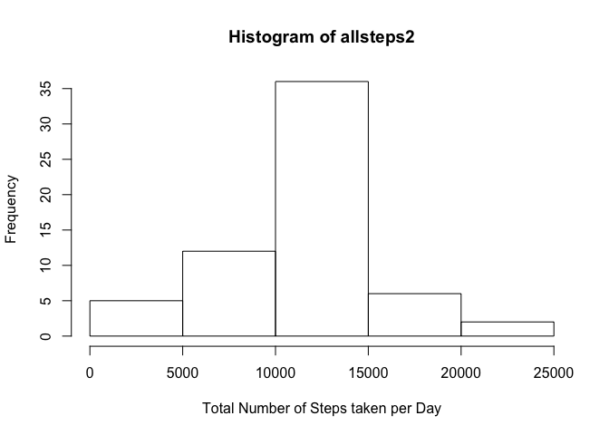
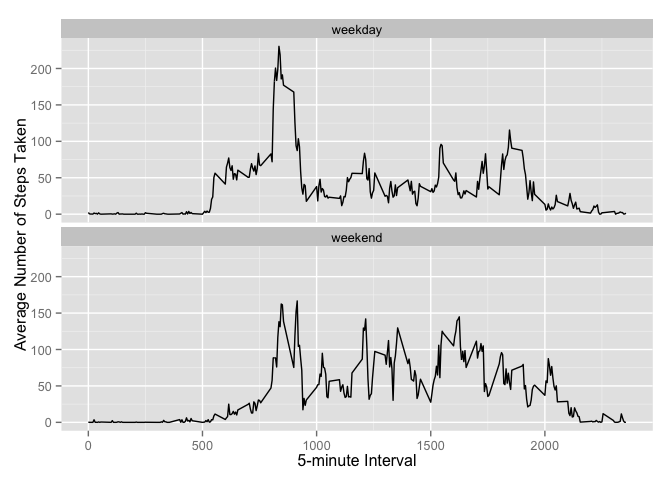

# Reproducible Research: Peer Assessment 1


## Loading and preprocessing the data


```r
download.file("https://raw.githubusercontent.com/vfoss/RepData_PeerAssessment1/master/activity.csv", 
              "activity.csv", method="curl")

activity <- read.csv("activity.csv", colClasses=c("numeric","Date","numeric"),
                     row.names = NULL, stringsAsFactors = FALSE, header=TRUE)
```

## What is the total number of steps taken per day?

1. Calculate the total number of steps taken per day

```r
allsteps <- tapply(activity$steps, activity$date, sum, na.rm=TRUE)
```
  
  
2. Make a histogram of the total number of steps taken each day

```r
hist(allsteps, xlab="Total Number of Steps taken per Day")
```

 

3. Calculate and report the mean and median of the total number of steps taken per day

```r
mean(allsteps)
```

```
## [1] 9354.23
```


```r
median(allsteps)
```

```
## [1] 10395
```

## What is the average daily activity pattern?
1. Make a time series plot of the 5-minute interval (x-axis) and the average number of steps taken, averaged across all days (y-axis)

```r
stepintervals <- tapply(activity$steps,activity$interval,mean,na.rm=TRUE)

plot(names(stepintervals), stepintervals, type="l", 
           xlab="5-minute Interval", ylab="Average Number of Steps Taken")
```

 
  
2. Which 5-minute interval, on average across all the days in the dataset, contains the maximum number of steps?

```r
as.numeric(names(stepintervals)[which.max(stepintervals)])
```

```
## [1] 835
```

## Imputing missing values
Note that there are a number of days/intervals where there are missing values (coded as NA). The presence of missing days may introduce bias into some calculations or summaries of the data.

1. Calculate and report the total number of missing values in the dataset (i.e. the total number of rows with NAs)

```r
sum(!complete.cases(activity))
```

```
## [1] 2304
```

2. Devise a strategy for filling in all of the missing values in the dataset. The strategy does not need to be sophisticated. For example, you could use the mean/median for that day, or the mean for that 5-minute interval, etc.

```r
activity2<-activity

for (n in 1:nrow(activity2)) if (is.na(activity2[n,1]))
        activity2[n,1]<-as.numeric(stepintervals[as.character(activity2[n,3])])
```
  
3. Create a new dataset that is equal to the original dataset but with the missing data filled in.

```r
## Show head of original dataset
head(activity,10)
```

```
##    steps       date interval
## 1     NA 2012-10-01        0
## 2     NA 2012-10-01        5
## 3     NA 2012-10-01       10
## 4     NA 2012-10-01       15
## 5     NA 2012-10-01       20
## 6     NA 2012-10-01       25
## 7     NA 2012-10-01       30
## 8     NA 2012-10-01       35
## 9     NA 2012-10-01       40
## 10    NA 2012-10-01       45
```


```r
## Show head of new dataset
head(activity2,10)
```

```
##        steps       date interval
## 1  1.7169811 2012-10-01        0
## 2  0.3396226 2012-10-01        5
## 3  0.1320755 2012-10-01       10
## 4  0.1509434 2012-10-01       15
## 5  0.0754717 2012-10-01       20
## 6  2.0943396 2012-10-01       25
## 7  0.5283019 2012-10-01       30
## 8  0.8679245 2012-10-01       35
## 9  0.0000000 2012-10-01       40
## 10 1.4716981 2012-10-01       45
```

4. Make a histogram of the total number of steps taken each day and Calculate and report the mean and median total number of steps taken per day. Do these values differ from the estimates from the first part of the assignment? What is the impact of imputing missing data on the estimates of the total daily number of steps?

```r
allsteps2 <- tapply(activity2$steps, activity2$date, sum, na.rm=TRUE)
```


```r
hist(allsteps2, xlab="Total Number of Steps taken per Day")
```

 


```r
mean(allsteps2)
```

```
## [1] 10766.19
```


```r
median(allsteps2)
```

```
## [1] 10766.19
```

  
Yes this histogram, mean and median values differ from the earlier estimates. This is because there are a number of days in the orignal dataset where, because of missing data, the total number of steps reported is 0, as you can see below:  

```r
head(data.frame(totalsteps=allsteps),10)
```

```
##            totalsteps
## 2012-10-01          0
## 2012-10-02        126
## 2012-10-03      11352
## 2012-10-04      12116
## 2012-10-05      13294
## 2012-10-06      15420
## 2012-10-07      11015
## 2012-10-08          0
## 2012-10-09      12811
## 2012-10-10       9900
```
  
The impact, therefore, of imputing missing data on the estimates of the total daily number of steps is to replace these extreme values (0) that are almost certainly inaccurate with more probable data (by replacing all the original NA values with the mean number of steps calculated for that particular 5-minute interval from all of the days where the data was not missing).  
  
## Are there differences in activity patterns between weekdays and weekends?

For this part the weekdays() function may be of some help here. Use the dataset with the filled-in missing values for this part.

1. Create a new factor variable in the dataset with two levels – “weekday” and “weekend” indicating whether a given date is a weekday or weekend day.

```r
require(Hmisc)
```

```
## Loading required package: Hmisc
## Loading required package: grid
## Loading required package: lattice
## Loading required package: survival
## Loading required package: Formula
## Loading required package: ggplot2
## 
## Attaching package: 'Hmisc'
## 
## The following objects are masked from 'package:base':
## 
##     format.pval, round.POSIXt, trunc.POSIXt, units
```

```r
for (n in 1:nrow(activity2)) {
        if (weekdays(activity2[n,2]) %in% c("Monday","Tuesday","Wednesday",
                                            "Thursday","Friday"))
                activity2[n,4] <- "weekday"
        
        if (weekdays(activity2[n,2]) %in% c("Saturday","Sunday"))
                activity2[n,4] <- "weekend"
}

activity2$V4 <- as.factor(activity2$V4)
```

2. Make a panel plot containing a time series plot (i.e. type = "l") of the 5-minute interval (x-axis) and the average number of steps taken, averaged across all weekday days or weekend days (y-axis). 

```r
require(ggplot2)

ggplot(activity2) +
        aes(interval,steps) +
        stat_summary(fun.y = "mean",geom = "line") +
        facet_wrap(~ V4,nrow = 2) + xlab("5-minute Interval") + 
        ylab("Average Number of Steps Taken")
```

 
